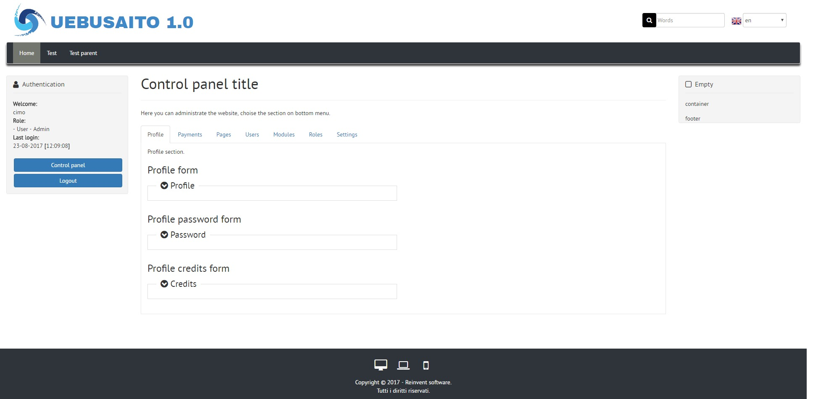
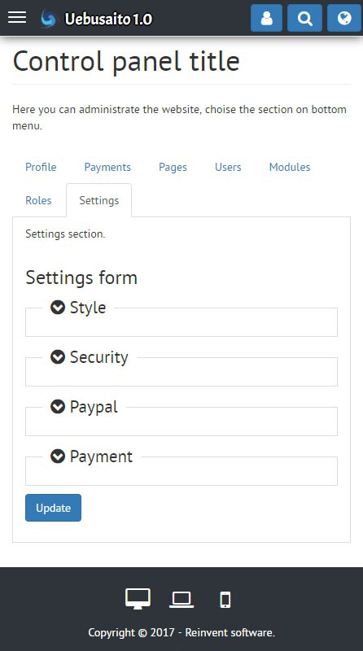

Uebusaito
==============

This is a open source cms with symfony framework

| Features |
|:---|
| Full responsive (smartphone, tablet, pc) |
| Multibrowser (Chrome, firefox, internet explorer, opera, safari) |
| Dynamic multilanguage |
| Login, registration and recover password |
| Search in website |
| Credit and paypal payment |
| Upload file system |
| Wysiwyg page creation (Create page without code) |
| Extend with module system |
| Scss style |

| Control panel |
|:---|
| Profile management |
| Payments management |
| Pages create and management |
| Users create and management |
| Modules create and management |
| Roles create and management |
| Settings management |

## Images

## Instructions:
1) On linux, open terminal and write:

	sudo curl -LsS http://symfony.com/installer -o /usr/local/bin/symfony
	
	sudo chmod a+x /usr/local/bin/symfony
	
	sudo symfony new /YOUR_PATH/symfony_3.3_fw 3.3
	
	sudo chmod 775 /YOUR_PATH/symfony_3.3_fw
	
	sudo chown -R YOUR_USER:www-data /YOUR_PATH/symfony_3.3_fw
	
	sudo find /YOUR_PATH/symfony_3.3_fw -type d -exec chmod 775 {} \;
	
	sudo find /YOUR_PATH/symfony_3.3_fw -type f -exec chmod 664 {} \;

2) Download this git and copy <b>"symfony_3.3_fw"</b> content in <b>"/YOUR_PATH/symfony_3.3_fw"</b> (Replace all).

3) Insert in your mysql database <b>"/symfony_3.3_fw/src/ReinventSoftware/UebusaitoBundle/uebusaito.sql"</b>.

4) On linux, open terminal and write:

	cd /YOUR_PATH/symfony_3.3_fw
	
	sudo -u www-data php bin/console cache:clear --no-warmup --env=dev
	
	sudo -u www-data php bin/console assets:install --symlink --relative
	
	sudo -u www-data php bin/console server:start YOUR_IP:80

5) Go on your browser and write <b>"https://YOUR_IP/symfony_3.3_fw/web/app_dev.php"</b>

6) For admin login use <b>"cimo, Password1"</b>.

<b>By CIMO - www.reinventsoftware.org</b>